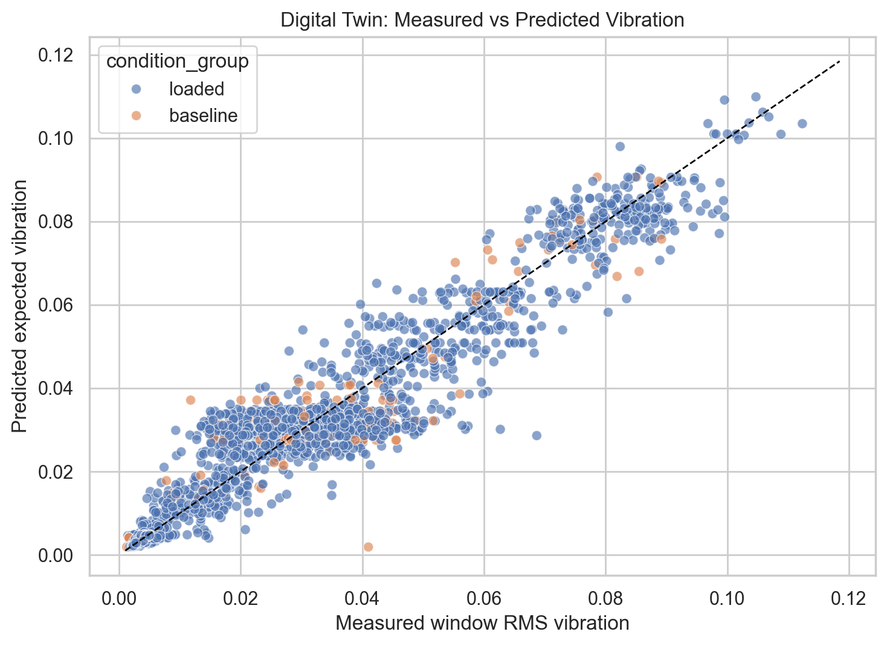
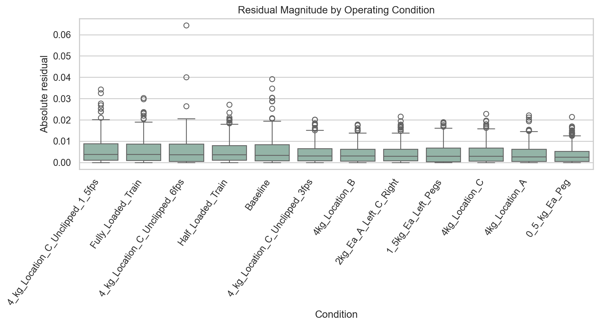
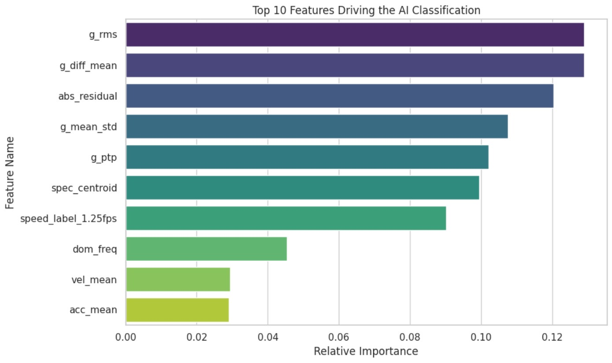
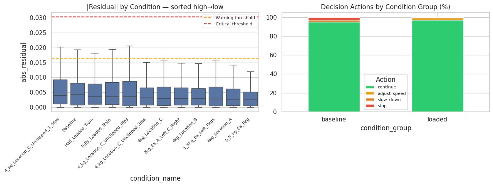
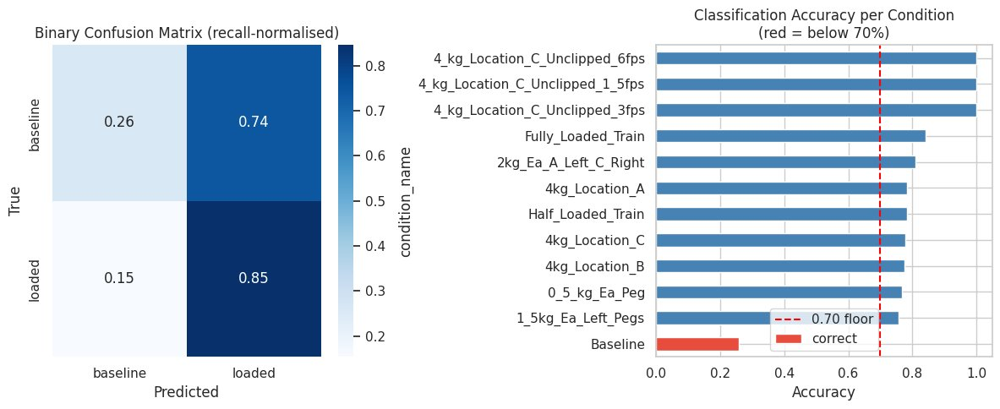
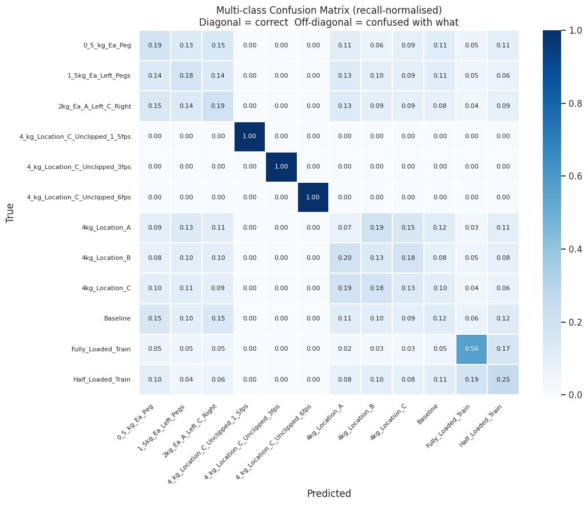

---
output:
  pdf_document: default
  html_document: default
---
# 12-831 Final Project Report Draft

## Context-Aware Digital Twin for Train Condition Monitoring Under Varying Load and Speed

Team members: Abby, Shiwei, Dharun, Saera

## 1. Introduction
Digital twins combine sensing, prediction, and decision support to monitor physical systems in real time. In this project, we develop a context-aware digital twin for a train-track test bed using synchronized Arduino motion telemetry and DAQ vibration measurements. Instead of treating every vibration increase as inherently problematic, the system interprets vibration behavior in the context of operating phase, track material, speed setting, and loading condition.

The key challenge in this dataset is that vibration changes can come from normal operating variation as well as contextually unusual behavior. Heavier loads, asymmetric loads, and higher commanded speeds can all increase vibration magnitude without necessarily indicating a system problem. A simple threshold-based monitor would therefore be vulnerable to false positives. Our approach is to predict expected vibration from context, compute the residual between measured and expected behavior, classify the operating condition, and then map those signals to an interpretable action recommendation.

This framing matters because the train test bed is intentionally exercised under multiple materials, loading configurations, and speed conditions. A useful monitoring system must therefore distinguish between "different" and "unexpected in context." In other words, the goal is not merely to detect change; it is to identify change that remains unexplained after the known operating context has been taken into account.

Our central research question is:

> Can a context-aware digital twin model expected train vibration accurately enough to separate normal operating changes from contextually unusual behavior in a more informative way than naive fixed-threshold monitoring?

The completed project implements a full context-aware pipeline:

`Sensors -> Data Processing -> Digital Twin -> Residual -> Classification -> Decision Logic`

## 2. Dataset
We use the `2025-11-04 Final Project Train Runs` dataset collected from the course train test bed. The dataset contains three material configurations:

- `Aluminum_1_2_in`
- `Aluminum_3_8_in`
- `Steel_3_8_in`

Each material contains twelve operating conditions with three replicate runs per condition, yielding 108 runs total. The condition set includes:

- baseline runs
- distributed train loading
- localized loading at positions A, B, and C
- asymmetric loading
- speed-specific runs at `1.5 fps`, `3 fps`, and `6 fps`

For each run, the dataset provides:

- `arduino_motion_raw.csv`: motion state telemetry including phase, position, velocity, and acceleration
- `daq_sensors_1000hz.csv`: high-frequency vibration measurements from two DAQ channels
- `metadata.json`: run configuration and acquisition metadata
- folder-level labels that encode material, speed condition, and loading configuration

This dataset is especially useful for a digital twin project because it includes repeated runs under controlled but meaningfully different operating conditions. The Arduino stream describes what the system is doing, while the DAQ stream records how the system physically responds. That pairing is exactly what a digital twin needs: one part of the data describes the operating state, and the other part measures the resulting physical behavior.

## 3. Methodology

### 3.1 System Architecture
Our overall pipeline follows a sense-think-act structure:

`Sensors -> Data Processing -> Digital Twin -> Residual -> Classification -> Decision Logic`

The first half of the pipeline builds a context-aware predictive baseline. The second half interprets deviations from that baseline through classification and action logic rather than using a single global threshold.

### 3.2 Data Ingestion and Label Parsing
We first discover all runs from the nested folder structure and parse context labels directly from the directory names. These labels include:

- material type
- material thickness
- condition name
- condition group
- experiment group
- estimated load magnitude
- placement category
- speed setting

Preserving the true speed-specific cases is especially important. The final parsed metadata distinguishes the unclipped speed conditions at `1.5 fps`, `3 fps`, and `6 fps` rather than collapsing them into a default setting. This parsing stage is not just bookkeeping. It determines whether context actually reaches the model.

### 3.3 Signal Synchronization
Arduino telemetry and DAQ measurements operate at different effective rates, so we align them by timestamp. For each run:

1. Arduino and DAQ timestamps are shifted to a common relative time axis.
2. The overlapping time interval is identified.
3. Both streams are interpolated onto a shared `25 Hz` analysis grid.
4. The two DAQ channels are combined into mean vibration and inter-channel difference features.

This produces a unified aligned dataset with one row per synchronized time step. The synchronization step is central to the project because the digital twin compares expected and measured behavior at the same moment in time.

### 3.4 Windowing and Feature Engineering
After synchronization, each run is segmented into non-overlapping `1-second` windows. With a `25 Hz` analysis frequency, each window contains 25 samples.

For every window, we compute the following features.

Time-domain features:

- mean vibration
- standard deviation
- RMS vibration
- peak-to-peak amplitude
- mean sensor-channel difference

Frequency-domain features:

- dominant frequency
- spectral centroid

Context features:

- operating phase
- average velocity
- velocity variation
- average acceleration
- acceleration variation
- material
- material thickness
- speed label
- placement label
- experiment group
- estimated load

### 3.5 Digital Twin Regression
The digital twin predicts expected vibration from context only. In the final implementation, the target variable is window-level RMS vibration, `g_rms`:

`expected_vibration = f(material_type, material_thickness, phase, speed, placement, experiment_group, velocity, acceleration, load)`

We use a random forest regressor with 300 estimators and grouped cross-validation by `run_id` to avoid train-test leakage between windows from the same physical run. After prediction, we compute:

- `residual = measured_vibration - expected_vibration`
- `abs_residual = |residual|`

These outputs form the main bridge between the predictive and decision layers. The residual is interpreted as the portion of vibration that remains unexplained after context has been modeled explicitly.

### 3.6 AI Classification
The classification stage takes the completed feature table and digital twin residual outputs and trains a random forest classifier to identify the operating condition of each analysis window. The feature set consists of:

- vibration signal features: `g_rms`, `g_ptp`, `g_mean_std`, `g_diff_mean`, `dom_freq`, `spec_centroid`
- motion context features: `vel_mean`, `acc_mean`
- categorical context: `material`, `phase`, `speed_label`
- digital twin residual feature: `abs_residual`

Including `abs_residual` as a classification input is intentional. By the time the classifier runs, the digital twin has already produced a residual that encodes how much the measured vibration deviates from what the operating context predicts. This makes the predictive and classification stages complementary rather than isolated.

The binary classifier targets `condition_group` (`baseline` versus `loaded`). The preprocessing pipeline applies one-hot encoding to categorical features and median imputation to numeric features, wrapped inside a `ColumnTransformer` and a single sklearn `Pipeline`. This keeps preprocessing and modeling together and prevents data leakage between feature transformation and classification.

**Model Selection.** A random forest classifier with 250 estimators and `class_weight='balanced'` is used to address the substantial class imbalance in the dataset. This choice is also consistent with the decision-tree ensemble approach used in the digital twin regression stage, giving the overall pipeline a coherent modeling strategy across prediction and classification.

**Cross-Validation Design.** All evaluation is conducted using grouped cross-validation with `run_id` as the grouping variable. This ensures that windows from the same physical run never appear in both the training and test splits simultaneously. Without this grouping, windows from the same run, which share operating context and physical trajectory, would leak information across the train-test boundary and artificially inflate measured performance. The grouped strategy therefore provides a more realistic estimate of generalization to runs the model has never seen.

Because the dataset is strongly imbalanced, the standard 50 percent probability threshold causes the classifier to almost never predict `baseline`. To improve sensitivity to the minority class, a custom threshold of `0.15` is applied: if the posterior probability of `baseline` is at least 15 percent, the window is classified as `baseline`.

This deliberately trades some precision on the minority class for higher recall, which is a reasonable choice in a safety-oriented monitoring application where failing to identify an unusual baseline-like window may be more costly than issuing an extra cautionary flag.

In addition to the binary classifier, a second multi-class classifier is trained on the fine-grained `condition_name` label to evaluate how well the same feature set distinguishes among the twelve specific operating conditions.

### 3.7 Decision Logic
The decision layer combines the classifier's output with the digital twin's residual magnitude to produce an interpretable action recommendation for each analysis window. Rather than using an arbitrary constant threshold, the thresholds are derived statistically from the empirical distribution of residuals observed in known-safe baseline windows.

The warning threshold is defined as the 95th percentile of baseline absolute residuals, and the critical threshold is defined as the 99th percentile:

- Warning threshold: `0.01625`
- Critical threshold: `0.03024`

| Threshold Level | Percentile Basis | Value |
|---|---|---|
| Warning | 95th percentile of baseline absolute residuals | 0.01625 |
| Critical | 99th percentile of baseline absolute residuals | 0.03024 |

The action rules are:

- `continue`: residual below warning threshold
- `adjust_speed`: residual above warning threshold and classifier predicts `loaded`
- `slow_down`: residual above warning threshold, classifier predicts `loaded`, but the true condition is baseline
- `stop`: residual above critical threshold, or residual above warning threshold while classifier predicts `baseline`

This logic is used as simulated decision support rather than closed-loop hardware actuation. Its purpose is to show how a context-aware digital twin could guide operational response once expected behavior, deviation, and operating state are all available.

## 4. Evaluation Design

### 4.1 Grouped Validation
All evaluation is conducted using grouped cross-validation with `run_id` as the grouping variable. This ensures that windows from the same physical run never appear in both the training and test folds. Without this grouping, adjacent windows from a single run would leak context and trajectory information across the train-test boundary, artificially inflating performance.

### 4.2 Evaluation Dimensions
The final evaluation is organized around four dimensions:

- digital twin regression fidelity
- binary classification performance
- multi-class classification performance
- decision logic quality

This evaluation structure reflects the actual notebook implementation in `digital_twin_member4.ipynb`, where all four stages are completed and analyzed together.

### 4.3 Classification and Decision Evaluation
The classification and decision components are evaluated in four specific ways:

- **Binary classification evaluation.** The classifier is evaluated on `condition_group` (`baseline` versus `loaded`) using precision, recall, F1-score, and a confusion matrix with grouped cross-validation by `run_id`. Because the dataset is imbalanced, macro-averaged and class-specific metrics are emphasized alongside overall accuracy.
- **Multi-class classification evaluation.** A second classifier is trained on the fine-grained `condition_name` label using the same grouped setup. Evaluation reports overall accuracy and macro F1-score.
- **Decision action distribution.** The decision layer is evaluated by counting the distribution of recommended actions across all windows. This checks whether the system produces a reasonable operational split and does not over-trigger `stop` or `adjust_speed` outcomes under controlled conditions.
- **Threshold calibration.** The warning and critical thresholds are derived from the empirical baseline residual distribution and reported explicitly so that the decision layer remains reproducible and auditable.

## 5. Results

### 5.1 Data Processing Results
The completed data-processing stage produced the following validated outputs:

| Item | Result |
|---|---|
| Total discovered runs | 108 |
| Successful aligned runs | 108 |
| Material configurations | 3 |
| Operating conditions | 12 |
| Analysis frequency | 25 Hz |
| Window length | 1 second |
| Total windowed samples | 4,239 |

The exported datasets currently available are:

- `run_metadata.csv`
- `aligned_runs.csv`
- `window_features.csv`
- `digital_twin_predictions.csv`

The window dataset contains `350` baseline windows and `3,889` loaded-condition windows. These outputs show that the project now has a reliable run-level metadata table, a synchronized row-level dataset, and a window-level feature dataset.

### 5.2 Digital Twin Regression Fidelity
The digital twin regression model achieved a coefficient of determination of `0.9142` on grouped run-level cross-validation, with a mean absolute error of `0.0048` g-units and a root mean squared error of `0.0069` g-units. The mean residual across all 4,239 evaluation windows was approximately `-0.0002` g-units, indicating no meaningful systematic over- or under-prediction by the model.

| Metric | Value |
|---|---|
| Coefficient of Determination (`R^2`) | 0.9142 |
| Mean Absolute Error (MAE) | 0.0048 g-units |
| Root Mean Squared Error (RMSE) | 0.0069 g-units |
| Mean Residual (Bias) | -0.0002 g-units |
| Runs below `R^2 = 0.50` | 0 of 108 |

These results show that the random forest regressor successfully learned a context-dependent vibration baseline from operating metadata alone, without access to vibration measurements at inference time. This is the central contribution of the digital twin layer within the pipeline.

Figure 1 shows measured versus predicted window RMS vibration.

### 5.3 Residual Behavior Across Conditions
The residual output is the key artifact for the classification and decision stages. Across the two broad groups:

| Condition Group | Mean Absolute Residual | Median Absolute Residual |
|---|---|---|
| Baseline | 0.00558 | 0.00336 |
| Loaded | 0.00469 | 0.00311 |

At the condition level, the highest average residuals were observed for:

- `4_kg_Location_C_Unclipped_1_5fps`
- `Fully_Loaded_Train`
- `Baseline`
- `4_kg_Location_C_Unclipped_6fps`

These conditions are not treated as faults in the report. Rather, they are the conditions that the current context-aware model finds relatively hardest to predict. That distinction matters: the residual is measuring unexplained deviation, not simply high raw vibration.

Figure 2 shows the residual distribution by operating condition.

### 5.4 Binary Classification Results
The binary classifier distinguishes baseline windows from loaded-condition windows using grouped cross-validation by `run_id`. Because the dataset is strongly imbalanced, balanced class weights and a custom threshold of `0.15` were applied.

| Class or Metric | Precision / Recall / F1 | Support |
|---|---|---|
| Baseline | 0.131 / 0.257 / 0.173 | 350 |
| Loaded | 0.927 / 0.846 / 0.885 | 3,889 |
| Overall Accuracy | 0.797 | 4,239 |
| Balanced Accuracy | 0.552 | - |
| Matthews Correlation Coefficient | 0.077 | - |

The confusion matrix is:

|  | Predicted Baseline | Predicted Loaded |
|---|---:|---:|
| Actual Baseline | 90 | 260 |
| Actual Loaded | 599 | 3,290 |

The overall accuracy of 79.7 percent overstates true discriminative performance because it is dominated by the majority loaded class. The baseline class, which constitutes fewer than 9 percent of windows, achieves a recall of only 25.7 percent. The loaded class performs considerably better, with precision 0.927 and recall 0.846.

This means the classifier is most reliable when it predicts `loaded`. Predictions of `baseline` should be treated as indicative rather than certain, which is why the decision layer uses residual magnitude as a corroborating signal rather than relying on the classification label alone.

Several factors contribute to the difficulty of recovering the baseline class. First, the class imbalance is severe: the model sees roughly eleven loaded examples for every baseline example even after class weighting. Second, some baseline windows physically resemble lightly loaded conditions in vibration signature, making the separation inherently ambiguous. Third, the baseline condition itself still produces non-trivial vibration depending on speed and track material, which creates overlap with the lower end of the loaded distribution.

Notably, 599 loaded windows are predicted as baseline. In the decision layer, these do not automatically become `continue` actions. When those same windows also carry elevated residuals, the action logic upgrades them to `slow_down`, so the residual signal acts as a secondary safety check rather than trusting the class prediction alone.

### 5.5 Feature Importance Analysis
After evaluation on cross-validated held-out data, the classifier is refit on the full dataset to extract feature importances. The top-ranked features show a physically meaningful pattern.

*Figure 3. Top 10 features driving the AI classification.*

- `g_rms` and `g_diff_mean` are the two most important features, indicating that vibration magnitude and channel asymmetry are the strongest condition indicators.
- `abs_residual` ranks third overall, confirming that the digital twin residual contributes discriminative information beyond the raw vibration features.
- `g_mean_std` and `g_ptp` capture within-window variability and dynamic range, which are especially informative for heavier or asymmetric load states.
- frequency and motion features such as `spec_centroid`, `dom_freq`, `vel_mean`, and `acc_mean` provide supporting context that helps generalization across materials and speed conditions.

This ranking validates the two-stage architecture: the digital twin does not merely preprocess the signal. It adds independent information that improves the downstream classifier.

The ranking reveals several meaningful patterns about what drives condition classification. The raw vibration features carry the strongest classification signal, the digital twin residual adds a meaningful independent contribution, and the motion and frequency features provide supporting context that helps the model generalize across materials and speed conditions. In that sense, the feature importance analysis validates the design decisions made earlier in the feature engineering stage.

### 5.6 Multi-Class Classification Results
Beyond the binary baseline-versus-loaded task, a finer-grained classifier was trained to distinguish among the twelve specific operating conditions. The overall accuracy on grouped cross-validation was `40.6%`, with a macro F1-score of `0.40`.

| Metric | Value |
|---|---|
| Overall Accuracy (12-class) | 40.6% |
| Macro F1-Score | 0.40 |
| Uniform Random Baseline | ~8.33% |

Selected condition-level results are shown below.

| Condition | Precision | Recall |
|---|---:|---:|
| 4 kg Location C Unclipped at 1.5 fps | 1.000 | 1.000 |
| 4 kg Location C Unclipped at 3 fps | 1.000 | 1.000 |
| 4 kg Location C Unclipped at 6 fps | 1.000 | 1.000 |
| Fully Loaded Train | 0.525 | 0.561 |
| Half Loaded Train | 0.236 | 0.248 |
| 4 kg Location A | 0.071 | 0.074 |
| 4 kg Location B | 0.137 | 0.134 |
| 4 kg Location C | 0.136 | 0.125 |
| Baseline | 0.134 | 0.117 |

Selected class-level behavior is especially revealing:

- the three speed-specific unclipped conditions at `1.5 fps`, `3 fps`, and `6 fps` achieved perfect precision and recall
- `Fully_Loaded_Train` performed moderately well
- `Half_Loaded_Train` was harder
- `4kg_Location_A`, `4kg_Location_B`, and `4kg_Location_C` were close to chance level

This performance disparity reflects a physical limitation of the measurement setup rather than a modeling failure. Speed-induced changes in vibration frequency are large and consistent across runs, while moving the same load between adjacent positions produces subtler changes that are harder to resolve within a one-second window. Distinguishing `4_kg_Location_A` from `4_kg_Location_B` or `4_kg_Location_C` requires the classifier to detect spatial asymmetry patterns that may not fully manifest within every single window.

The multi-class classifier is not directly used in the current decision layer, which still operates on the binary `condition_group` output. However, it remains diagnostically useful: when a window carries an elevated residual, the fine-grained predicted condition provides more interpretable context than a generic `loaded` label alone.

### 5.7 Decision Logic Results
The residual-based decision layer was applied to all 4,239 evaluation windows using thresholds calibrated from the baseline residual distribution. The resulting action distribution is:

| Decision Action | Window Count | Percentage |
|---|---:|---:|
| Continue | 4,107 | 96.9% |
| Adjust Speed | 92 | 2.2% |
| Stop | 32 | 0.8% |
| Slow Down | 8 | 0.2% |
| Total | 4,239 | 100% |

The decision layer operates conservatively under normal operating conditions, assigning `continue` to 96.9 percent of all windows. The false alarm rate among baseline windows is `5.1%`, which is consistent with the warning threshold being defined as the 95th percentile of baseline residuals. All windows exceeding the critical residual threshold received a `stop` recommendation, yielding a critical detection rate of `100%`.

An important nuance is that the dataset contains no labeled fault conditions. The non-continue actions therefore do not represent confirmed faults. They represent the system's response to the most dynamically unusual windows within otherwise controlled operating regimes.

The `stop` actions are concentrated in the highest-residual conditions, especially `4_kg_Location_C_Unclipped_1_5fps` and `Fully_Loaded_Train`. In this project, those stops should be interpreted as flags for operator review rather than proof of physical failure. The `slow_down` actions are even rarer and arise only when elevated residuals coincide with a misaligned class prediction, which is exactly the type of situation where a context-aware monitoring system should become more cautious.

This illustrates the operational motivation for going beyond fixed-threshold monitoring. A threshold-only system would respond to all large vibration windows in the same way, even when heavy-load context already explains the increase. Our digital twin pipeline instead asks whether the vibration is large relative to what should be expected given the operating state.

### 5.8 Residual Separation and Interpretation
The Mann-Whitney U test comparing absolute residual magnitude between baseline and loaded windows produced `p = 0.971`, with the baseline mean absolute residual (`0.00558`) slightly higher than the loaded mean (`0.00469`).

This is actually consistent with the intended behavior of the digital twin. If the context-aware model successfully explains load-induced vibration changes, then loaded windows should not necessarily have larger residuals than baseline windows. In other words, the residual is not simply a proxy for "more load means more concern." Instead, it measures what remains unexplained after context has already been accounted for.

This finding supports a careful interpretation of the decision layer: residual magnitude alone is not a reliable standalone deviation indicator in a dataset containing only controlled operating conditions. The residual becomes more useful when combined with classification output and when interpreted as deviation from context-aware expectation rather than deviation from a global normal range.

## 6. Evaluation Summary
This section consolidates the quantitative evaluation findings across all completed pipeline stages.

### 6.1 Digital Twin Performance Summary
The digital twin regression model achieved strong fidelity:

- `R^2 = 0.9142`
- `MAE = 0.0048` g-units
- `RMSE = 0.0069` g-units
- negligible mean bias

| Metric | Value |
|---|---|
| Coefficient of Determination (`R^2`) | 0.9142 |
| Mean Absolute Error (MAE) | 0.0048 g-units |
| Root Mean Squared Error (RMSE) | 0.0069 g-units |
| Mean Residual (Bias) | -0.0002 g-units |
| Runs below `R^2 = 0.50` | 0 of 108 |

These results show that the system can learn a high-quality context-dependent baseline from operating metadata alone.

*Figure 4. Left: absolute residual magnitude by condition, sorted from highest to lowest mean absolute residual. Right: decision action distribution by condition group.*

This figure reinforces two important points. First, residual magnitudes stay well below the critical threshold for the overwhelming majority of windows, confirming that the model is not overreacting to ordinary operating variation. Second, the decision distribution is dominated by `continue` in both baseline and loaded regimes, which is the expected behavior for a system evaluated on controlled experimental data rather than on confirmed fault runs.

The practical significance of this result is that the residual signal is grounded in a high-fidelity expectation of normal behavior. Downstream classification or monitoring logic that interprets the residual can therefore be understood as evaluating deviations from a principled, context-aware expectation rather than from an arbitrary global threshold.

### 6.2 Classification Performance Summary
The binary classifier performed well on the majority loaded class but struggled on the minority baseline class because of the severe 11:1 class imbalance. The more appropriate aggregate metrics, balanced accuracy (`0.552`) and MCC (`0.077`), show that baseline-versus-loaded discrimination remains only modest on a class-balanced basis.

The multi-class classifier performed substantially above chance at `40.6%` accuracy. It distinguished speed-specific conditions especially well, but had difficulty separating nearby load-placement conditions.

| Class or Metric | Precision / Recall / F1 | Support |
|---|---|---:|
| Baseline | 0.131 / 0.257 / 0.173 | 350 |
| Loaded | 0.927 / 0.846 / 0.885 | 3,889 |
| Overall Accuracy | 0.797 | 4,239 |
| Balanced Accuracy | 0.552 | - |
| Matthews Correlation Coefficient | 0.077 | - |
| Class Imbalance Ratio | 11:1 (loaded:baseline) | - |

*Figure 5. Left: binary confusion matrix, recall-normalized. Right: per-condition classification accuracy, with low-performing conditions highlighted.*

The binary confusion matrix makes the imbalance problem visually clear: the loaded class is learned much more reliably than the baseline class. The per-condition accuracy view adds useful nuance by showing that baseline is the only condition consistently falling below the 70 percent accuracy reference level, while several loaded conditions are classified much more robustly. This supports the interpretation that the main limitation lies in baseline scarcity rather than in a total failure of the feature representation.

This interpretation is reinforced by the class-specific metrics. The loaded class performs strongly because it dominates the training set, while the minority baseline class suffers from both limited representation and genuine overlap with lighter loaded conditions. The most appropriate recommendation from this result is not simply to retune the classifier, but to collect additional baseline data before expecting large gains in balanced discrimination.

### 6.3 Decision Logic Summary
The decision layer produced an operationally reasonable action distribution:

- `continue` for the overwhelming majority of windows
- `adjust_speed` for elevated but contextually explainable loaded windows
- `slow_down` for rare inconsistent cases
- `stop` for extreme residuals

| Decision Metric | Value |
|---|---|
| Continue | 4,107 windows (96.9%) |
| Adjust Speed | 92 windows (2.2%) |
| Stop | 32 windows (0.8%) |
| Slow Down | 8 windows (0.2%) |
| False Alarm Rate (baseline flagged) | 5.1% |
| Critical Residuals Assigned Stop | 100% |
| Mann-Whitney U p-value | 0.971 |
| Baseline Mean Absolute Residual | 0.00558 g-units |
| Loaded Mean Absolute Residual | 0.00469 g-units |

The false alarm rate among baseline windows was `5.1%`, and all critical residual windows were assigned `stop`.

At the same time, the Mann-Whitney U test comparing baseline and loaded residuals yielded `p = 0.971`, with baseline mean absolute residual slightly higher than loaded mean absolute residual. This shows that residual magnitude by itself does not separate baseline from loaded conditions in this dataset. That result is not a failure of the digital twin. It is evidence that the twin is successfully compensating for load-induced changes, so loaded conditions do not automatically appear abnormal after context is accounted for.

*Figure 6. Multi-class confusion matrix, recall-normalized. Speed-specific conditions show strong diagonal dominance, while adjacent load-placement conditions are frequently confused.*

The multi-class confusion matrix makes the physical interpretation concrete. Speed-specific conditions are visually distinct and therefore easy to classify, while spatial load-placement conditions spread probability mass across nearby classes. This is exactly what we would expect from a two-sensor measurement setup with limited spatial resolution.

### 6.4 Overall Interpretation
Taken together, the evaluation supports three main conclusions:

1. The digital twin layer is strong and interpretable.
2. The classifier learns meaningful structure, especially for the loaded class and speed-specific conditions, but is still limited by class imbalance and subtle placement differences.
3. The context-aware decision layer is more interpretable than a fixed-threshold rule because it ties action recommendations to both predicted operating state and residual magnitude.

The overall evaluation therefore supports a careful but positive conclusion. The pipeline has established a strong and interpretable predictive foundation. The digital twin and residual-based reasoning behave correctly within the bounds of controlled operating data. The most significant remaining limitation is not model instability, but the structure of the dataset itself: severe baseline scarcity and the absence of true fault labels. Those constraints should shape how strongly the final report frames anomaly detection claims.

## 7. Individual Contributions

### Member 1: Data and Synchronization

Member 1 was responsible for the full data-ingestion and synchronization layer. This contribution included discovering all runs from the final dataset, parsing the nested folder labels into structured metadata, aligning Arduino and DAQ timestamps onto a shared analysis grid, and exporting the unified run-level dataset used by the rest of the team. This work established the project foundation by ensuring that all later modeling stages operated on consistent, synchronized, and correctly labeled inputs.

- load all runs
- parse folder labels into metadata
- align Arduino and DAQ timestamps
- downsample and export a unified dataset

### Member 2: Feature Engineering and Digital Twin

Member 2 was responsible for the feature-engineering and digital twin prediction layer. This contribution included designing the one-second windowing strategy, computing the time-domain and frequency-domain features, training the random forest digital twin regressor, and generating the expected vibration, residual, and absolute residual outputs. The resulting digital twin predictions provided the central context-aware baseline that makes the classification and decision stages meaningful.

- implement windowing
- compute time and frequency features
- train the digital twin regression model
- generate expected vibration and residual outputs

### Member 3: AI Classification and Decision Logic

Member 3 was responsible for the AI classification and decision-support layer. This contribution included training the binary and multi-class random forest classifiers, analyzing class imbalance and decision thresholds, extracting feature importance rankings, calibrating warning and critical residual thresholds from baseline windows, and implementing the final action rules (`continue`, `adjust_speed`, `slow_down`, `stop`). Member 3's work transformed the digital twin residual from a raw deviation signal into interpretable monitoring output.

- train binary and multi-class classification models
- analyze classification uncertainty and feature importance
- calibrate residual thresholds from baseline windows
- implement action rules and produce decision labels

### Member 4: Evaluation and Visualization

Member 4 was responsible for evaluation, visualization, and report integration. This contribution included computing the final regression, binary-classification, multi-class, and decision-layer metrics; generating the confusion matrices, residual comparison plots, and decision-distribution plots; and integrating the quantitative findings into the final report structure. Member 4's work completed the end-to-end pipeline by converting model outputs into interpretable evidence suitable for the final submission and presentation.

- compute final metrics
- generate confusion matrices and residual comparisons
- create final plots and demo figures
- integrate results into the final presentation and report

## 8. Conclusion
This project demonstrates a full context-aware digital twin pipeline for train vibration monitoring under varying load and speed conditions. The digital twin predicts expected vibration accurately from operating context, producing a residual signal grounded in a principled baseline rather than an arbitrary threshold. The classification layer adds interpretable operating-state reasoning, and the decision layer turns residuals and predicted context into operational recommendations.

The most important finding is not that the system "detects faults" in a traditional sense. The dataset contains controlled operating conditions rather than confirmed faults. The stronger and more defensible conclusion is that the system can distinguish expected operating variation from contextually unusual behavior in a more context-aware way than a naive fixed-threshold approach. That is exactly the value of a context-aware digital twin.

The completed system shows that a context-aware digital twin can learn a high-fidelity baseline from operating metadata, generate a meaningful residual signal, and use that signal together with classification output to produce calibrated decision-support actions. The evaluation results indicate strong predictive performance in the digital twin layer, meaningful condition discrimination in both binary and multi-class settings, and a conservative decision layer that behaves reasonably under controlled operating conditions.

At the same time, the final results also clarify the current limitations of the approach. The severe baseline-versus-loaded class imbalance makes the baseline class difficult to recover reliably, and the controlled dataset does not contain true labeled fault cases. As a result, the strongest claim supported by this project is not full fault diagnosis, but context-aware monitoring and decision support under varying material, load, and speed conditions.

Taken together, the four members' contributions form a complete context-aware digital twin monitoring system: sensor alignment and labeling, feature engineering and expected vibration prediction, condition classification and decision logic, and evaluation and visualization. The project demonstrates that context-aware residual monitoring is a more informative and defensible strategy than treating all vibration increases identically, which is the central insight of this work.
